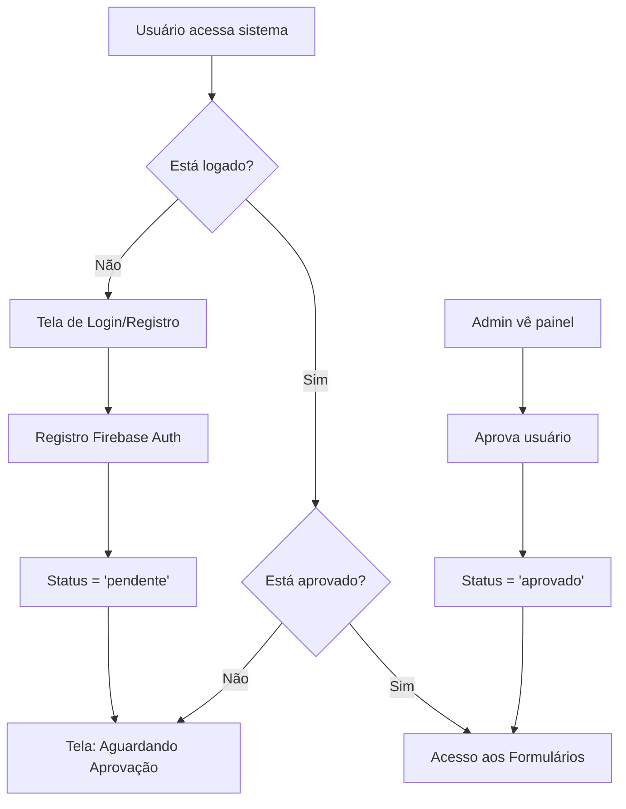

# 📋 Sistema de Formulários OS - Documentação Completa

**Desenvolvido por:** Arielton Henemann  
**Data:** 31 de Agosto de 2025  
**Tecnologias:** React + TypeScript + Firebase + Vercel  
**URL do Sistema:** https://meu-app-formulario.vercel.app  

---

## 📖 Índice

1. [Visão Geral](#visão-geral)
2. [Arquitetura do Sistema](#arquitetura-do-sistema)
3. [Passo a Passo da Implementação](#passo-a-passo-da-implementação)
4. [Funcionalidades Implementadas](#funcionalidades-implementadas)
5. [Sistema de Autenticação](#sistema-de-autenticação)
6. [Deploy e Produção](#deploy-e-produção)
7. [Como Usar o Sistema](#como-usar-o-sistema)
8. [Estrutura de Arquivos](#estrutura-de-arquivos)
9. [Comandos Úteis](#comandos-úteis)
10. [Próximos Passos](#próximos-passos)

---

## 🎯 Visão Geral

O **Sistema de Formulários OS** é uma aplicação web corporativa desenvolvida para gerenciar ordens de serviço técnico de forma eficiente. O sistema permite:

- ✅ **Criar** formulários de 3 tipos: CTO, PON e LINK
- ✅ **Gerenciar** formulários salvos (listar, editar, excluir)
- ✅ **Gerar arquivos TXT** automaticamente
- ✅ **Controlar acesso** de usuários via aprovação manual
- ✅ **Funcionar online/offline** com backup híbrido
- ✅ **Administrar usuários** via painel administrativo

---

## 🏗️ Arquitetura do Sistema

### **Frontend**
- **Framework:** React 18 com TypeScript
- **Estilo:** CSS-in-JS (inline styles)
- **Componentes:** Funcionais com Hooks
- **Estado:** Context API + useState/useEffect

### **Backend/Armazenamento**
- **Primário:** Firebase Firestore (NoSQL)
- **Backup:** localStorage (navegador)
- **Autenticação:** Firebase Authentication
- **Arquivos:** Download direto no navegador

### **Deploy**
- **Hosting:** Vercel (domínio personalizado)
- **CI/CD:** Deploy automático via GitHub
- **SSL:** HTTPS automático
- **Performance:** Build otimizada com compressão

### **Estrutura de Dados**

```typescript
// Formulário CTO
interface OrdemServico {
  codigoOS: string;
  cto: string;
  regiao: string;
  upcOuApc: string;
  splitter: string;
  identificada: string;
  nivelAntes: string;
  nivelPos: string;
  problema: string;
  resolucao: string;
  materialUtilizado: string;
  endereco: string;
  localizacao: string;
}

// Usuário do Sistema
interface UsuarioStatus {
  uid: string;
  email: string;
  displayName?: string | null;
  status: 'pendente' | 'aprovado' | 'rejeitado';
  dataCriacao: Date;
  dataAprovacao?: Date;
  aprovadoPor?: string;
}
```

---

## 📝 Passo a Passo da Implementação

### **Fase 1: Setup Inicial (Etapas 1-5)**

#### **1. Criação do Projeto React**
```bash
npx create-react-app web --template typescript
cd web
npm start
```

#### **2. Estrutura de Pastas**
```
src/
├── components/          # Componentes React
├── shared/             # Código compartilhado
│   ├── types/          # Interfaces TypeScript
│   ├── services/       # Serviços (Firebase, storage)
│   ├── utils/          # Utilitários (geração TXT)
│   ├── contexts/       # Context API
│   └── config/         # Configurações
└── App.tsx             # Componente principal
```

#### **3. Criação dos Types/Interfaces**
- **OrdemServico** (CTO): Dados para formulários CTO
- **OrdemServicoPON** (PON): Dados específicos PON  
- **OrdemServicoLINK** (LINK): Dados com múltiplos links
- **FormularioSalvo**: Metadados dos formulários salvos

#### **4. Componentes de Formulário**
- **FormularioOS** (CTO): Campos específicos para CTOs
- **FormularioPON**: Campos para equipamentos PON
- **FormularioLINK**: Formulário dinâmico com múltiplos links
- **Validação**: Campos opcionais, interface responsiva

#### **5. Geração de Arquivos TXT**
```typescript
// Exemplo: Geração TXT para CTO
export const gerarArquivoCTO = (dados: OrdemServico) => {
  const conteudo = `
CÓDIGO DA O.S: ${dados.codigoOS}
CTO: ${dados.cto}
REGIÃO: ${dados.regiao}
PROBLEMA: ${dados.problema}
RESOLUÇÃO: ${dados.resolucao}
  `;
  
  const blob = new Blob([conteudo], { type: 'text/plain' });
  const url = URL.createObjectURL(blob);
  const link = document.createElement('a');
  link.href = url;
  link.download = `OS-CTO-${dados.codigoOS}.txt`;
  link.click();
};
```

### **Fase 2: Armazenamento e Gerenciamento (Etapas 6-10)**

#### **6. Sistema de Storage Híbrido**
```typescript
// Prioridade: Firebase → localStorage
class FirebaseFormularioStorage {
  async salvar(tipo: string, dados: any) {
    try {
      // Tentar Firebase primeiro
      await addDoc(collection(db, 'formularios'), {
        tipo, dados, dataCriacao: new Date()
      });
    } catch (error) {
      // Fallback para localStorage
      const stored = localStorage.getItem('formularios') || '[]';
      const formularios = JSON.parse(stored);
      formularios.push({ tipo, dados, id: uuid() });
      localStorage.setItem('formularios', JSON.stringify(formularios));
    }
  }
}
```

#### **7. Configuração Firebase**
```typescript
// firebase.ts
const firebaseConfig = {
  apiKey: "sua-api-key",
  authDomain: "projeto.firebaseapp.com",
  projectId: "projeto-id",
  storageBucket: "projeto.firebasestorage.app",
  messagingSenderId: "123456789",
  appId: "1:123456789:web:abcd1234"
};

const app = initializeApp(firebaseConfig);
export const db = getFirestore(app);
export const auth = getAuth(app);
```

#### **8. Componente de Gerenciamento**
- **GerenciarFormularios**: Lista todos formulários salvos
- **Filtros**: Por tipo (CTO, PON, LINK)
- **Ações**: Editar, Excluir, Visualizar
- **Interface**: Cards responsivos com informações

#### **9. Navegação entre Telas**
```typescript
type TelaAtiva = 'GERENCIAR' | 'CTO' | 'PON' | 'LINK';

const NavegacaoFormularios = ({ telaAtiva, onMudarTela }) => {
  // Botões dinâmicos com indicação visual da tela ativa
  // Modo edição com breadcrumbs
};
```

#### **10. Edição de Formulários**
- **Estado compartilhado**: dadosIniciais via props
- **Modo edição**: Indicação visual diferente
- **Navegação**: Voltar para gerenciar após salvar
- **Validação**: Preservar dados durante edição

### **Fase 3: Autenticação e Segurança (Etapas 11-15)**

#### **11. Firebase Authentication Setup**
```bash
# Habilitar no Console Firebase:
# 1. Authentication → Get Started
# 2. Sign-in method → Email/Password ✅
```

#### **12. Serviço de Autenticação**
```typescript
class AuthService {
  async registrar(email: string, password: string) {
    const userCredential = await createUserWithEmailAndPassword(auth, email, password);
    // Criar status pendente no Firestore
    await userService.criarUsuarioStatus(userCredential.user.uid, email);
    return userCredential.user;
  }
  
  async login(email: string, password: string) {
    const userCredential = await signInWithEmailAndPassword(auth, email, password);
    // Verificar se usuário está aprovado
    const status = await userService.verificarStatusUsuario(userCredential.user.uid);
    return { user: userCredential.user, isApproved: status?.status === 'aprovado' };
  }
}
```

#### **13. Sistema de Aprovação Manual**
```typescript
// Fluxo de aprovação:
// 1. Usuário se registra → Status: "pendente"
// 2. Admin vê solicitação no painel
// 3. Admin aprova → Status: "aprovado" 
// 4. Usuário ganha acesso ao sistema

interface UsuarioStatus {
  uid: string;
  email: string;
  status: 'pendente' | 'aprovado' | 'rejeitado';
  dataCriacao: Date;
  dataAprovacao?: Date;
  aprovadoPor?: string;
}
```

#### **14. Context de Autenticação**
```typescript
const AuthProvider = ({ children }) => {
  const [user, setUser] = useState(null);
  const [isLoading, setIsLoading] = useState(true);

  useEffect(() => {
    const unsubscribe = onAuthStateChanged(auth, async (firebaseUser) => {
      if (firebaseUser) {
        const status = await userService.verificarStatusUsuario(firebaseUser.uid);
        setUser({
          ...firebaseUser,
          isApproved: status?.status === 'aprovado'
        });
      } else {
        setUser(null);
      }
      setIsLoading(false);
    });
    return unsubscribe;
  }, []);

  return (
    <AuthContext.Provider value={{ user, isLoading, login, logout }}>
      {children}
    </AuthContext.Provider>
  );
};
```

#### **15. Proteção de Rotas**
```typescript
const ProtectedRoute = ({ children }) => {
  const { user, isLoading } = useAuth();

  if (isLoading) return <LoadingScreen />;
  if (!user) return <Login />;
  if (user.isApproved === false) return <PendingApprovalScreen />;
  
  return <>{children}</>;
};
```

### **Fase 4: Painel Administrativo (Etapas 16-20)**

#### **16. Configuração de Administradores**
```typescript
// Firestore: admin_settings/admins
{
  lista: ["uid-do-admin-1", "uid-do-admin-2"]
}

// Verificação automática
const verificarSeEhAdmin = async (uid: string): Promise<boolean> => {
  const doc = await getDoc(doc(db, 'admin_settings', 'admins'));
  return doc.data()?.lista?.includes(uid) || false;
};
```

#### **17. AdminPanel - Aprovação de Usuários**
```typescript
const AdminPanel = () => {
  const [usuariosPendentes, setUsuariosPendentes] = useState([]);

  const aprovarUsuario = async (uid: string) => {
    await updateDoc(doc(db, 'users', uid), {
      status: 'aprovado',
      dataAprovacao: Timestamp.now(),
      aprovadoPor: currentUser.uid
    });
    // Recarregar lista
    carregarUsuariosPendentes();
  };

  return (
    <div>
      {usuariosPendentes.map(usuario => (
        <div key={usuario.uid}>
          <h4>{usuario.email}</h4>
          <button onClick={() => aprovarUsuario(usuario.uid)}>
            ✅ Aprovar
          </button>
          <button onClick={() => rejeitarUsuario(usuario.uid)}>
            ❌ Rejeitar
          </button>
        </div>
      ))}
    </div>
  );
};
```

#### **18. AdminSetup - Configuração Automática**
```typescript
// Ferramenta para transformar usuário em admin
const AdminSetup = () => {
  const { user } = useAuth();

  const tornarAdmin = async () => {
    await setDoc(doc(db, 'admin_settings', 'admins'), {
      lista: [user.uid]
    });
    alert('Você agora é administrador!');
  };

  return (
    <button onClick={tornarAdmin}>
      ✨ Me Tornar Administrador
    </button>
  );
};
```

#### **19. Sistema de Permissões**
```typescript
// Navegação dinâmica baseada em permissões
const NavegacaoFormularios = () => {
  const { user } = useAuth();
  const [isAdmin, setIsAdmin] = useState(false);

  // Botões básicos (todos usuários)
  const botoesBasicos = ['GERENCIAR', 'CTO', 'PON', 'LINK'];
  
  // Botões administrativos (só admins)
  const botoesAdmin = ['ADMIN', 'SETUP', 'DEBUG'];
  
  const botoes = isAdmin ? [...botoesBasicos, ...botoesAdmin] : botoesBasicos;
  
  return (
    <div>
      {botoes.map(botao => (
        <button key={botao} onClick={() => onMudarTela(botao)}>
          {botao}
        </button>
      ))}
    </div>
  );
};
```

#### **20. Ferramentas de Debug**
```typescript
// DebugFirestore - Testar conexões e permissões
const DebugFirestore = () => {
  const testarSalvamento = async () => {
    try {
      await setDoc(doc(db, 'test', 'teste'), {
        timestamp: new Date(),
        teste: 'funcionando'
      });
      setResultado('✅ Firebase funcionando!');
    } catch (error) {
      setResultado(`❌ Erro: ${error.message}`);
    }
  };

  return (
    <div>
      <button onClick={testarSalvamento}>🧪 Testar Firestore</button>
      <div>{resultado}</div>
    </div>
  );
};
```

### **Fase 5: Deploy e Produção (Etapas 21-25)**

#### **21. Configuração do GitHub**
```bash
# Conectar repositório local ao GitHub
git remote add origin https://github.com/arieltonhenemann/meu-app-formulario.git
git branch -M main
git push -u origin main
```

#### **22. Deploy no Vercel**
```bash
# Opção 1: Via Web Interface
# 1. Acessar vercel.com
# 2. Login com GitHub  
# 3. Import Project → Selecionar repositório
# 4. Deploy automático

# Opção 2: Via CLI
npm install -g vercel
vercel login
vercel --prod
```

#### **23. Configuração de Ambiente**
```typescript
// Build otimizada
npm run build

// Variáveis de ambiente (se necessário)
REACT_APP_FIREBASE_API_KEY=sua-api-key
REACT_APP_FIREBASE_PROJECT_ID=projeto-id
```

#### **24. CI/CD Automático**
```yaml
# .github/workflows/deploy.yml (opcional)
name: Deploy to Vercel
on:
  push:
    branches: [main]
jobs:
  deploy:
    runs-on: ubuntu-latest
    steps:
      - uses: actions/checkout@v2
      - name: Deploy to Vercel
        uses: amondnet/vercel-action@v20
```

#### **25. Monitoramento**
- **URL Final**: https://meu-app-formulario.vercel.app
- **Deploy automático**: Push no GitHub → Deploy no Vercel
- **HTTPS**: Certificado SSL automático
- **Performance**: Build otimizada + compressão gzip

---

## ⚡ Funcionalidades Implementadas

### **📋 Sistema de Formulários**
- ✅ **3 tipos diferentes**: CTO, PON, LINK
- ✅ **Campos dinâmicos**: Links múltiplos no formulário LINK
- ✅ **Validação**: Campos opcionais, UX amigável
- ✅ **Geração TXT**: Download automático após salvar
- ✅ **Design responsivo**: Funciona em desktop/mobile

### **💾 Armazenamento Híbrido**
- ✅ **Firebase Firestore**: Armazenamento primário na nuvem
- ✅ **localStorage**: Backup local automático
- ✅ **Sincronização**: Tenta Firebase, fallback para local
- ✅ **Persistência**: Dados nunca são perdidos

### **🔐 Sistema de Autenticação**
- ✅ **Firebase Auth**: Login/registro seguro
- ✅ **Aprovação manual**: Admin controla novos usuários
- ✅ **Status de usuário**: Pendente → Aprovado → Acesso
- ✅ **Proteção de rotas**: Apenas usuários aprovados acessam

### **👑 Painel Administrativo**
- ✅ **Aprovação de usuários**: Lista pendentes para aprovação
- ✅ **Configuração admin**: Transformar usuário em admin em 1 clique
- ✅ **Controle de permissões**: Interface diferente para cada perfil
- ✅ **Ferramentas debug**: Testar conexões e diagnosticar problemas

### **📱 Interface e UX**
- ✅ **Design profissional**: Cores, ícones, tipografia consistente
- ✅ **Navegação intuitiva**: Abas claras, breadcrumbs
- ✅ **Feedback visual**: Loading, mensagens de sucesso/erro
- ✅ **Responsivo**: Funciona em qualquer dispositivo

### **🚀 Deploy e Produção**
- ✅ **URL própria**: https://meu-app-formulario.vercel.app
- ✅ **HTTPS**: Certificado SSL automático
- ✅ **CI/CD**: Deploy automático via GitHub
- ✅ **Performance**: Build otimizada, carregamento rápido

---

## 🔐 Sistema de Autenticação

### **Fluxo de Registro e Aprovação**



### **Tipos de Usuário**

| Tipo | Permissões | Interface |
|------|------------|-----------|
| **Não autenticado** | ❌ Nenhuma | Tela de login |
| **Pendente** | ❌ Aguardando | Tela de espera |
| **Aprovado** | ✅ Formulários | CTO, PON, LINK, Gerenciar |
| **Admin** | ✅ Tudo | Formulários + Admin + Setup + Debug |

### **Configuração Firebase Authentication**

```typescript
// 1. Firebase Console → Authentication → Get Started
// 2. Sign-in method → Email/Password ✅
// 3. Firestore Database → Create database
// 4. Rules → Allow authenticated users

// Regras Firestore (firestore.rules)
rules_version = '2';
service cloud.firestore {
  match /databases/{database}/documents {
    // Permitir leitura/escrita para usuários autenticados
    match /{document=**} {
      allow read, write: if request.auth != null;
    }
  }
}
```

---

## 🚀 Deploy e Produção

### **Configuração Vercel**

1. **Conta Vercel**
   - Criar conta em https://vercel.com
   - Conectar com GitHub

2. **Import Project**
   - Selecionar repositório: `arieltonhenemann/meu-app-formulario`
   - Framework: Create React App (detecção automática)
   - Build Command: `npm run build`
   - Output Directory: `build`

3. **Deploy**
   - Deploy automático a cada push no `main`
   - URL gerada: `https://meu-app-formulario.vercel.app`
   - SSL/HTTPS automático

### **URLs do Sistema**

| Ambiente | URL | Status |
|----------|-----|---------|
| **Produção** | https://meu-app-formulario.vercel.app | ✅ Ativo |
| **Desenvolvimento** | http://localhost:3000 | Local |
| **GitHub** | https://github.com/arieltonhenemann/meu-app-formulario | ✅ Público |

---

## 📖 Como Usar o Sistema

### **Para Novos Usuários**

1. **Acesso Inicial**
   - Ir para: https://meu-app-formulario.vercel.app
   - Clicar em "Criar uma conta"

2. **Registro**
   - Preencher email e senha (mín. 6 caracteres)
   - Confirmar senha
   - Clicar em "✨ Criar Conta"

3. **Aguardar Aprovação**
   - Tela: "Conta Pendente de Aprovação"
   - Administrador será notificado
   - Aguardar email/contato do admin

4. **Acesso Liberado**
   - Após aprovação: login normal
   - Interface com 4 abas: Gerenciar, CTO, PON, LINK

### **Para Usuários Aprovados**

1. **Login**
   - Email e senha
   - Acesso direto aos formulários

2. **Criar Formulário**
   - Escolher tipo: CTO, PON ou LINK
   - Preencher campos necessários
   - Clicar "💾 Salvar e Gerar TXT"
   - Download automático do arquivo TXT

3. **Gerenciar Formulários**
   - Aba "📋 Gerenciar"
   - Ver todos formulários salvos
   - Editar: ✏️ Editar
   - Excluir: 🗑️ Excluir

### **Para Administradores**

1. **Configurar Admin** (primeira vez)
   - Aba "⚙️ Configurar Admin"
   - Clicar "✨ Me Tornar Administrador"
   - Recarregar página

2. **Aprovar Usuários**
   - Aba "🛡️ Admin"
   - Ver lista de usuários pendentes
   - Clicar "✅ Aprovar" ou "❌ Rejeitar"

3. **Debug e Manutenção**
   - Aba "🧪 Debug"
   - Testar conectividade Firebase
   - Verificar permissões

---

## 📁 Estrutura de Arquivos

```
MeuAppCompleto/web/
├── public/
│   ├── index.html
│   └── favicon.ico
├── src/
│   ├── components/           # Componentes React
│   │   ├── FormularioOS.tsx      # Formulário CTO
│   │   ├── FormularioPON.tsx     # Formulário PON  
│   │   ├── FormularioLINK.tsx    # Formulário LINK
│   │   ├── GerenciarFormularios.tsx  # Lista/gerencia formulários
│   │   ├── NavegacaoFormularios.tsx  # Navegação entre telas
│   │   ├── Login.tsx             # Tela de login/registro
│   │   ├── ProtectedRoute.tsx    # Proteção de rotas
│   │   ├── Header.tsx            # Cabeçalho com user info
│   │   ├── AdminPanel.tsx        # Painel de aprovação
│   │   ├── AdminSetup.tsx        # Configuração admin
│   │   └── DebugFirestore.tsx    # Ferramentas debug
│   ├── shared/               # Código compartilhado
│   │   ├── types/              # Interfaces TypeScript
│   │   │   ├── os.ts               # Tipos para CTO
│   │   │   ├── pon.ts              # Tipos para PON
│   │   │   ├── link.ts             # Tipos para LINK
│   │   │   ├── usuario.ts          # Tipos de usuário
│   │   │   └── formularioSalvo.ts  # Metadados formulários
│   │   ├── services/           # Serviços
│   │   │   ├── authService.ts         # Autenticação
│   │   │   ├── userService.ts         # Gerenciamento usuários
│   │   │   ├── firebaseFormularioStorage.ts  # Storage híbrido
│   │   │   └── compatibilityStorage.ts       # Storage local puro
│   │   ├── contexts/          # Context API
│   │   │   └── AuthContext.tsx    # Contexto autenticação
│   │   ├── config/            # Configurações
│   │   │   └── firebase.ts        # Config Firebase
│   │   ├── utils/             # Utilitários
│   │   │   └── gerarArquivoTxt.ts  # Geração arquivos TXT
│   │   └── index.ts           # Exports compartilhados
│   ├── App.tsx               # Componente principal
│   ├── App.css               # Estilos globais
│   └── index.tsx             # Entry point
├── package.json              # Dependências
├── tsconfig.json             # Config TypeScript
├── .gitignore                # Arquivos ignorados git
└── DOCUMENTACAO_COMPLETA.md  # Esta documentação
```

### **Principais Arquivos**

| Arquivo | Função | Responsabilidade |
|---------|--------|------------------|
| `App.tsx` | Componente raiz | Roteamento, layout, contexto |
| `firebase.ts` | Config Firebase | Credenciais, inicialização |
| `authService.ts` | Autenticação | Login, registro, logout |
| `userService.ts` | Usuários | Aprovação, permissões |
| `firebaseFormularioStorage.ts` | Storage | Firebase + localStorage |
| `FormularioOS.tsx` | Formulário CTO | Interface, validação |
| `GerenciarFormularios.tsx` | Gerenciamento | CRUD formulários |
| `AdminPanel.tsx` | Admin | Aprovar usuários |

---

## ⚙️ Comandos Úteis

### **Desenvolvimento**
```bash
# Instalar dependências
npm install

# Executar em desenvolvimento
npm start

# Build para produção
npm run build

# Testar build local
npx serve -s build
```

### **Git e Deploy**
```bash
# Commitar mudanças
git add .
git commit -m "Sua mensagem"
git push origin main

# Deploy automático acontece via Vercel após push
```

### **Firebase (se necessário)**
```bash
# Instalar Firebase CLI
npm install -g firebase-tools

# Login Firebase
firebase login

# Deploy Firebase Functions (se usando)
firebase deploy --only functions
```

### **Vercel CLI (opcional)**
```bash
# Instalar Vercel CLI
npm install -g vercel

# Deploy manual
vercel --prod
```

---

## 🔧 Configurações Importantes

### **Firebase Firestore Rules**
```javascript
rules_version = '2';
service cloud.firestore {
  match /databases/{database}/documents {
    // Usuários autenticados podem ler/escrever
    match /{document=**} {
      allow read, write: if request.auth != null;
    }
  }
}
```

### **Firestore Collections Structure**
```
📁 formularios/           # Formulários salvos
  📄 doc-id-1
    ├── tipo: "CTO"
    ├── dados: { codigoOS, cto, regiao, ... }
    └── dataCriacao: timestamp

📁 users/                 # Status dos usuários  
  📄 uid-usuario-1
    ├── email: "user@email.com"
    ├── status: "aprovado"
    ├── dataCriacao: timestamp
    └── aprovadoPor: "uid-admin"

📁 admin_settings/        # Configurações admin
  📄 admins
    └── lista: ["uid-admin-1", "uid-admin-2"]
```

### **Environment Variables (se necessário)**
```bash
# .env (não commitado)
REACT_APP_FIREBASE_API_KEY=sua-api-key
REACT_APP_FIREBASE_AUTH_DOMAIN=projeto.firebaseapp.com
REACT_APP_FIREBASE_PROJECT_ID=projeto-id
```

---

## 🔍 Solução de Problemas

### **Problemas Comuns**

#### **1. "Firebase não configurado"**
- **Causa**: Credenciais inválidas em `firebase.ts`
- **Solução**: Verificar API keys no Firebase Console

#### **2. "Usuários não aparecem no painel admin"**
- **Causa**: Erro de índice Firestore ou permissões
- **Solução**: Criar índice composto ou ajustar regras

#### **3. "Permission denied"**
- **Causa**: Regras Firestore muito restritivas  
- **Solução**: Permitir acesso para usuários autenticados

#### **4. "Build falha no Vercel"**
- **Causa**: Dependências ou variáveis ambiente
- **Solução**: Verificar logs build, instalar dependências

### **Debug Tools**

1. **Console do Navegador (F12)**
   - Ver logs de Firebase
   - Erros JavaScript
   - Network requests

2. **Firebase Console**
   - Status Authentication
   - Dados Firestore
   - Regras e permissões

3. **Vercel Dashboard**
   - Logs de build
   - Deploy status
   - Analytics

4. **Ferramenta Debug Interna**
   - Acessar aba "🧪 Debug"
   - Testar conectividade
   - Verificar permissões

---

## 🚀 Próximos Passos

### **Melhorias Sugeridas**

#### **📧 Notificações por Email**
```typescript
// Integração com EmailJS ou SendGrid
const enviarNotificacaoAprovacao = async (user) => {
  await emailService.send({
    to: user.email,
    subject: 'Acesso aprovado - Sistema OS',
    template: 'aprovacao',
    data: { nome: user.displayName }
  });
};
```

#### **📊 Dashboard e Relatórios**
- Gráficos por tipo de formulário
- Estatísticas de uso
- Relatórios mensais em PDF

#### **📱 App Mobile (React Native)**
- Formulários offline-first
- Sincronização em background
- Notificações push

#### **🔔 Notificações Push**
- Novos formulários para admin
- Status de aprovação para usuários
- Lembretes de tarefas

#### **📦 Backup Automático**
```typescript
// Backup periódico para Google Drive ou email
const backupAutomatico = async () => {
  const dados = await exportarTodosDados();
  await uploadParaDrive(dados);
};
```

#### **👥 Múltiplos Níveis de Admin**
- Super Admin: Controle total
- Admin Regional: Apenas sua região
- Moderador: Aprovação limitada

#### **🔍 Busca Avançada**
```typescript
// Filtros avançados nos formulários
interface FiltrosBusca {
  dataInicio?: Date;
  dataFim?: Date;  
  regiao?: string;
  status?: string;
  palavraChave?: string;
}
```

#### **📋 Templates de Formulário**
- Templates pré-definidos
- Campos personalizáveis
- Import/Export de templates

### **Extensões Técnicas**

#### **🔒 Segurança Avançada**
- Rate limiting nas APIs
- Logs de auditoria
- 2FA (Two-Factor Authentication)

#### **⚡ Performance**
- Cache inteligente
- Lazy loading componentes
- Service Workers (PWA)

#### **🧪 Testes**
```typescript
// Jest + React Testing Library
describe('FormularioOS', () => {
  it('should save form data', async () => {
    const { getByRole } = render(<FormularioOS />);
    // ... test implementation
  });
});
```

#### **📈 Analytics**
- Google Analytics
- Tracking de uso
- Métricas de performance

---

## 📞 Suporte e Contato

### **Desenvolvedor**
- **Nome**: Arielton Henemann
- **Email**: arielton.henemann@gmail.com
- **GitHub**: https://github.com/arieltonhenemann

### **Sistema**
- **URL Produção**: https://meu-app-formulario.vercel.app
- **Repositório**: https://github.com/arieltonhenemann/meu-app-formulario
- **Status**: ✅ Ativo e Funcional

### **Tecnologias Utilizadas**
- **Frontend**: React 18 + TypeScript
- **Backend**: Firebase (Firestore + Auth)
- **Deploy**: Vercel
- **CI/CD**: GitHub Actions (automático)

---

## 📝 Histórico de Versões

| Versão | Data | Funcionalidades |
|--------|------|-----------------|
| **v1.0** | 31/08/2025 | Sistema base com formulários CTO, PON, LINK |
| **v1.1** | 31/08/2025 | Sistema de armazenamento híbrido |
| **v1.2** | 31/08/2025 | Gerenciamento de formulários |
| **v2.0** | 31/08/2025 | Sistema de autenticação Firebase |
| **v2.1** | 31/08/2025 | Aprovação manual de usuários |
| **v2.2** | 31/08/2025 | Painel administrativo completo |
| **v2.3** | 31/08/2025 | Sistema de permissões baseado em roles |
| **v3.0** | 31/08/2025 | Deploy em produção no Vercel |

---

## 🎉 Conclusão

O **Sistema de Formulários OS** é uma aplicação web completa e profissional que atende às necessidades de gerenciamento de ordens de serviço técnico.

### **✅ O Que Foi Alcançado**
- ✅ **Sistema funcional** em produção
- ✅ **Interface profissional** e intuitiva
- ✅ **Segurança robusta** com aprovação manual
- ✅ **Armazenamento confiável** híbrido
- ✅ **Deploy automatizado** e escalável

### **🎯 Benefícios para o Negócio**
- **Eficiência**: Formulários digitais substituem papéis
- **Controle**: Apenas usuários autorizados têm acesso
- **Backup**: Dados sempre seguros (online + offline)
- **Escalabilidade**: Suporta crescimento da equipe
- **Profissionalismo**: Interface moderna e confiável

### **🚀 Próximos Passos Recomendados**
1. **Treinar usuários** no sistema
2. **Configurar backup** periódico manual
3. **Implementar notificações** por email
4. **Coletar feedback** dos usuários
5. **Planejar melhorias** baseadas no uso real

---

**📋 Sistema de Formulários OS - Desenvolvido com ❤️ em React + TypeScript + Firebase**

*Documentação gerada em: 31 de Agosto de 2025*
